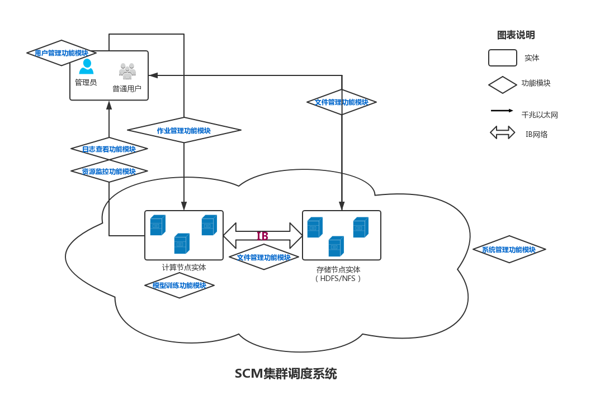
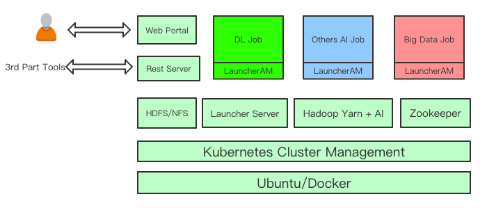

# SitonHoly Cluster Manager Platform（SCM）用户手册  
SCM是思腾合力推出的一款支持多种**机器学习**与**深度学习**框架的集群调度系统。基于Hadoop Yarn完成了对TensorFlow、MXNet、Caffe、Theano、PyTorch、Keras、XGBoost等常用框架的集成，同时具备良好的扩展性和兼容性。   
## 解决方案
自2013年以来，随着深度学习技术的不断发展，引发了新一轮人工智能热潮，诸如：AlphaGo、刷脸支付、无人驾驶、AR、无人超市等应用层出不穷。由于数据量不断增长，单GPU模式已不能再满足用户需求，因此，为了解决这一问题，思腾合力推出了**整体解决方案**。   
 
## 系统架构
SCM是基于Hadoop、K8s和Docker的集群调度系统，系统架构图如下：      
   
如图所示，用户可以通过Web Portal提交作业或监视群集状态，Web Portal再调用REST服务器所提供的API。也可以使用第三方工具直接调用REST服务器进行作业管理。在接收API调用后，REST Server与FrameworkLauncher（LauncherAM）协调以执行作业管理。Launcher Server处理来自REST服务器的请求并将作业提交给Hadoop YARN。由YARN调度GPU资源进行深度学习计算。其他类型的基于CPU的AI工作负载或传统大数据作业也可以在平台中运行，与那些基于GPU的作业共存。
## 用户手册
我们将系统功能分为三大类，即：   
#### 系统管理模块
1. [集群管理](notes/manage_clusters.md)  
2. [用户管理](notes/manage_users.md)  
3. [文件管理](notes/manage_files.md)
4. [镜像管理](notes/manage_images.md)
#### 模型训练模块
5. [作业提交](notes/submit_jobs.md)
6. [作业管理](notes/manage_jobs.md)
7. [资源监控](notes/resources_monitor.md)
#### 系统运维模块
8. [底层服务](notes/services.md)
9. [硬件利用率](notes/hardware.md)
10. [K8S仪表盘](notes/k8s.md)
## 标准测试程序
|框架|单机单卡|单机多卡|多机多卡|Horovod|
|:-:|:-:|:-:|:-:|:-:|
|Pytorch|[🔗](bm/pytorch-smsg.md)|[🔗](bm/pytorch-smmg.md)|[🔗](bm/pytorch-mmmg.md)|N/A|
|TensorFlow|[🔗](bm/tensorflow-smsg.md)|[🔗](bm/tensorflow-smmg.md)|N/A|N/A|
|MxNet|N/A|N/A|N/A|N/A|

