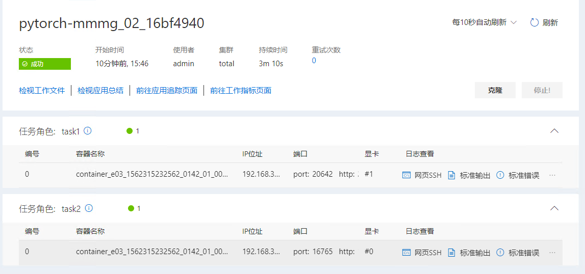
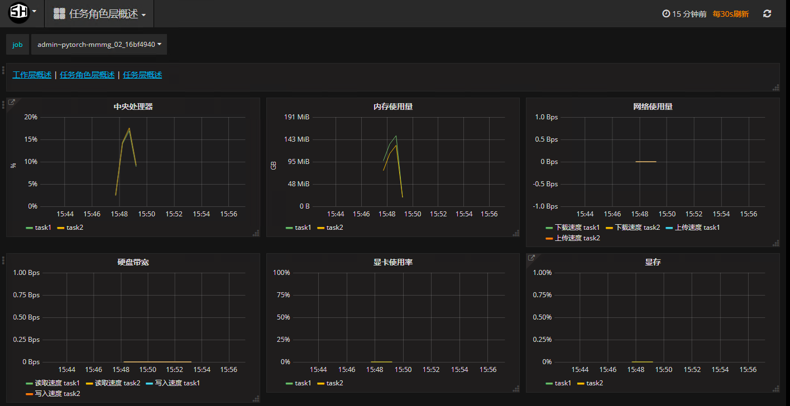

# Pytorch 多机多卡测试
## 一、准备数据和代码
### 1、下载
我们已将数据和代码存储到我公司的FTP服务器上，单击[此处](http://123.151.118.124:13390/sitonholy/scm/pytorch-smsg.tar.gz)下载，并将其上传到服务器上。    
### 2、上传数据
依次单击`系统管理->文件管理->文档上传`将文件（主要，文件应该是解压后的）上传到服务器。   
    
## 二、提交作业
JSON文件如下：    
```
{
  "jobName": "pytorch-mmmg_02_16bf4a18",
  "image": "sitonholy/ai:16.04-9.0-3.5-pmt",
  "authFile": "",
  "dataDir": "",
  "outputDir": "",
  "codeDir": "",
  "retryCount": 2,
  "taskRoles": [
    {
      "name": "task1",
      "taskNumber": 1,
      "cpuNumber": 1,
      "memoryMB": 8192,
      "shmMB": 2048,
      "gpuNumber": 1,
      "storageGB": 5,
      "minFailedTaskCount": null,
      "minSucceededTaskCount": null,
      "command": "cd /root/data/framework_benchmark/pytorch && python mmmg_toy.py --rank 0 --world-size 2 --ip $PAI_HOST_IP_task1_0  --port $PAI_PORT_LIST_task1_0_port",
      "portList": [
        {
          "label": "port",
          "beginAt": 0,
          "portNumber": 1
        }
      ]
    },
    {
      "name": "task2",
      "taskNumber": 1,
      "cpuNumber": 1,
      "memoryMB": 8192,
      "shmMB": 2048,
      "gpuNumber": 1,
      "storageGB": 5,
      "minFailedTaskCount": 1,
      "minSucceededTaskCount": null,
      "command": "cd /root/data/framework_benchmark/pytorch && python mmmg_toy.py --rank 1 --world-size 2 --ip $PAI_HOST_IP_task1_0  --port $PAI_PORT_LIST_task1_0_port",
      "portList": [
        {
          "label": "port",
          "beginAt": 0,
          "portNumber": 1
        }
      ]
    }
  ],
  "jobEnvs": {},
  "extras": {},
  "gpuType": "TITANX",
  "tmp": {
    "vgInfo": {
      "名称": "total",
      "正在跑工作数目": "0",
      "使用中內存/全部內存": "0/158720",
      "使用中硬盘/全部硬盘": "0/201",
      "使用中中央处理器/全部中中央处理器": "0/64",
      "显示卡(使用中/全部)": {
        "TITANX": "0/4",
        "P100": "0/2"
      }
    }
  }
}
```

## 三、日志查看
  
*图1*    
### 1、查看日志
单击图1中`标准输出`查看相应日志如下：   
   
### 2、资源监控
单击图1中`前往工作指标页面`查看资源利用情况：   
    
