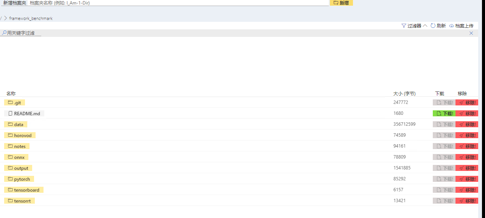
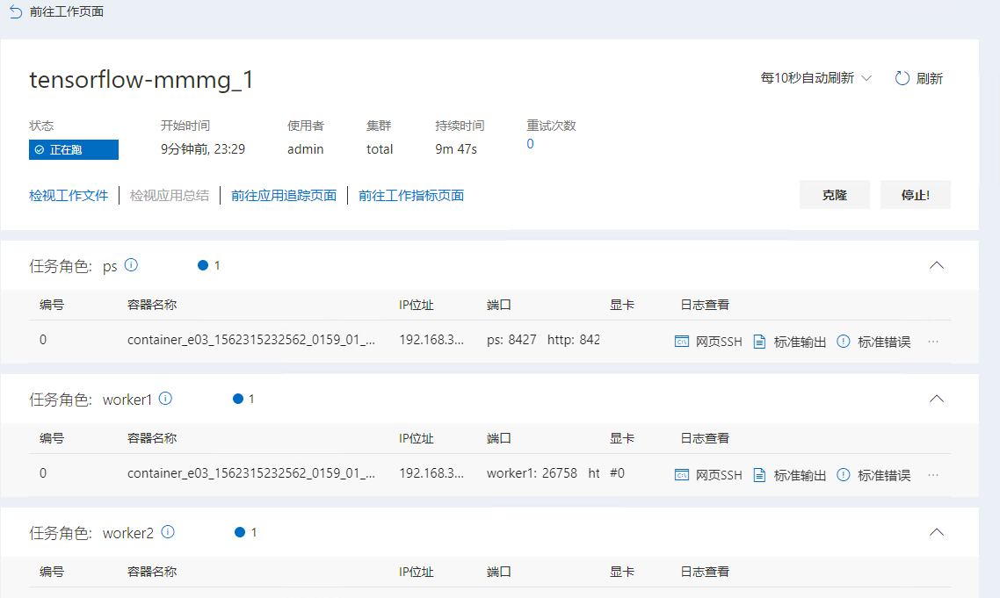
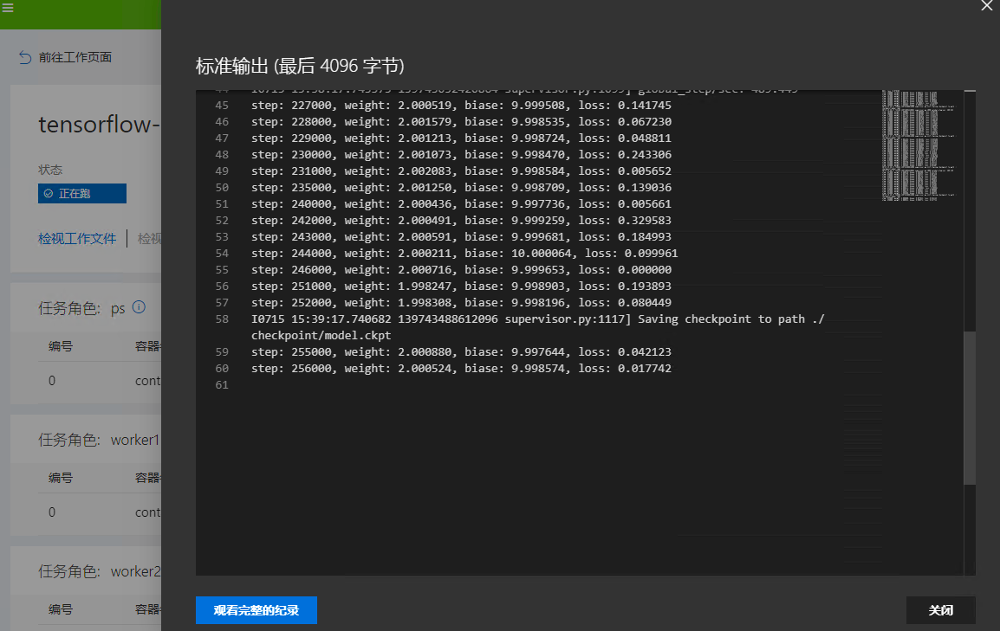
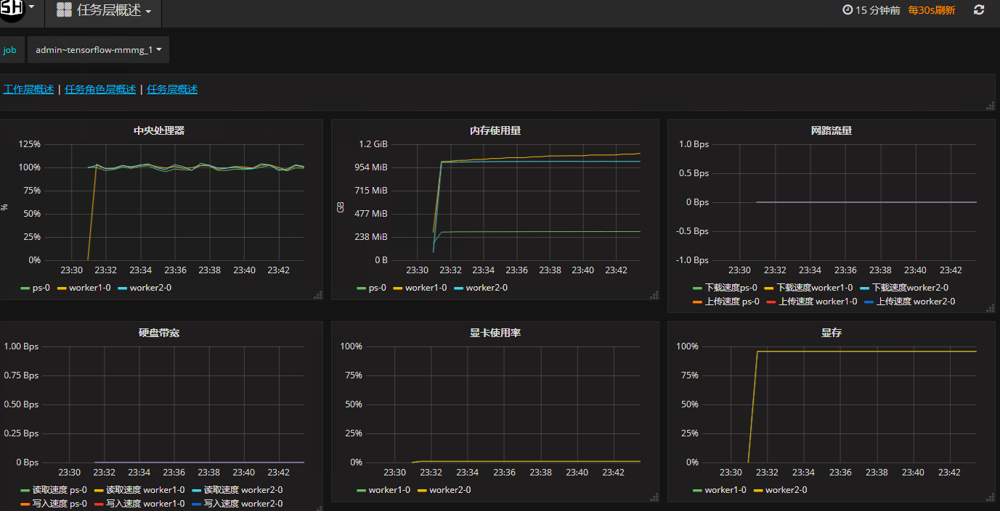

# Tensorflow多机多卡测试
参考：[🔗](https://github.com/fusimeng/framework_benchmark)
## 一、准备数据和代码
### 1、下载
我们已将数据和代码存储到我公司的FTP服务器上，单击[此处](http://123.151.118.124:13390/sitonholy/scm/tensorflow-mmmg.tar.gz)下载，并将其上传到服务器上。    
### 2、上传数据
依次单击`系统管理->文件管理->文档上传`将文件（主要，文件应该是解压后的）上传到服务器。   
    
## 二、提交作业
JSON文件如下：    
```
{
  "jobName": "tensorflow-mmmg_1",
  "image": "sitonholy/scm:16.04-10.0-7.4-3.6-4.1.0-pmt",
  "authFile": "",
  "dataDir": "",
  "outputDir": "",
  "codeDir": "",
  "retryCount": 0,
  "taskRoles": [
    {
      "name": "ps",
      "taskNumber": 1,
      "cpuNumber": 1,
      "memoryMB": 4096,
      "shmMB": 1024,
      "gpuNumber": 0,
      "storageGB": 1,
      "minFailedTaskCount": 1,
      "minSucceededTaskCount": null,
      "command": "cd /root/data/distributeTensorflowExample/ && CUDA_VISIBLE_DEVICES='' python distribute.py --ps_hosts=$PAI_HOST_IP_ps_0:$PAI_PORT_LIST_ps_0_ps --worker_hosts=$PAI_HOST_IP_worker1_0:$PAI_PORT_LIST_worker1_0_worker1,$PAI_HOST_IP_worker2_0:$PAI_PORT_LIST_worker2_0_worker2  --job_name=ps --task_index=0",
      "portList": [
        {
          "label": "ps",
          "beginAt": 0,
          "portNumber": 1
        }
      ]
    },
    {
      "name": "worker1",
      "taskNumber": 1,
      "cpuNumber": 1,
      "memoryMB": 4096,
      "shmMB": 1024,
      "gpuNumber": 1,
      "storageGB": 1,
      "minFailedTaskCount": 1,
      "minSucceededTaskCount": null,
      "command": "cd /root/data/distributeTensorflowExample/ && CUDA_VISIBLE_DEVICES=0  python distribute.py --ps_hosts=$PAI_HOST_IP_ps_0:$PAI_PORT_LIST_ps_0_ps --worker_hosts=$PAI_HOST_IP_worker1_0:$PAI_PORT_LIST_worker1_0_worker1,$PAI_HOST_IP_worker2_0:$PAI_PORT_LIST_worker2_0_worker2  --job_name=worker --task_index=0",
      "portList": [
        {
          "label": "worker1",
          "beginAt": 0,
          "portNumber": 1
        }
      ]
    },
    {
      "name": "worker2",
      "taskNumber": 1,
      "cpuNumber": 1,
      "memoryMB": 4096,
      "shmMB": 1024,
      "gpuNumber": 1,
      "storageGB": 1,
      "minFailedTaskCount": 1,
      "minSucceededTaskCount": null,
      "command": "cd /root/data/distributeTensorflowExample/ && CUDA_VISIBLE_DEVICES=0  python distribute.py --ps_hosts=$PAI_HOST_IP_ps_0:$PAI_PORT_LIST_ps_0_ps --worker_hosts=$PAI_HOST_IP_worker1_0:$PAI_PORT_LIST_worker1_0_worker1,$PAI_HOST_IP_worker2_0:$PAI_PORT_LIST_worker2_0_worker2  --job_name=worker --task_index=1",
      "portList": [
        {
          "label": "worker2",
          "beginAt": 0,
          "portNumber": 1
        }
      ]
    }
  ],
  "jobEnvs": {},
  "extras": {
    "virtualGroup": "total"
  },
  "gpuType": "TITANX"
}
```

## 三、日志查看
  
*图1*    
### 1、查看日志
单击图1中`标准输出`查看相应日志如下：   
   
### 2、资源监控
单击图1中`前往工作指标页面`查看资源利用情况：   
    
