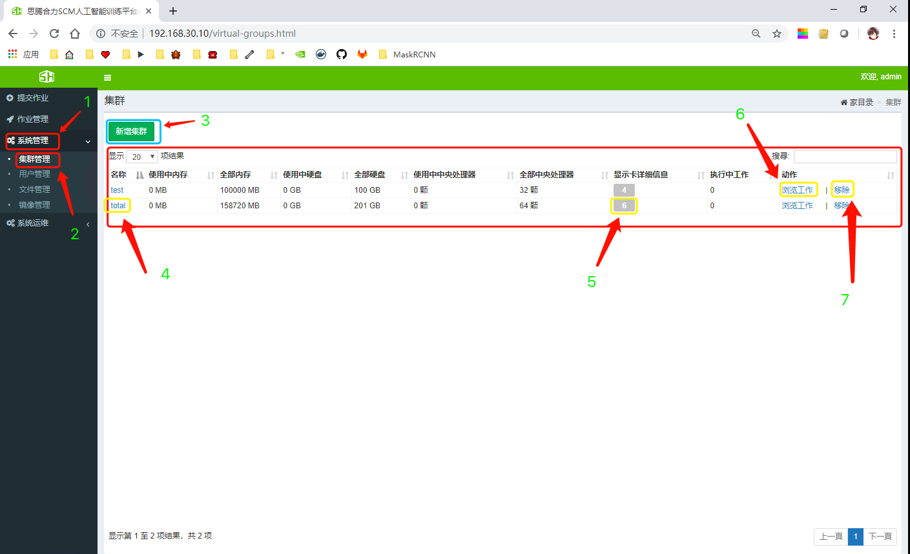
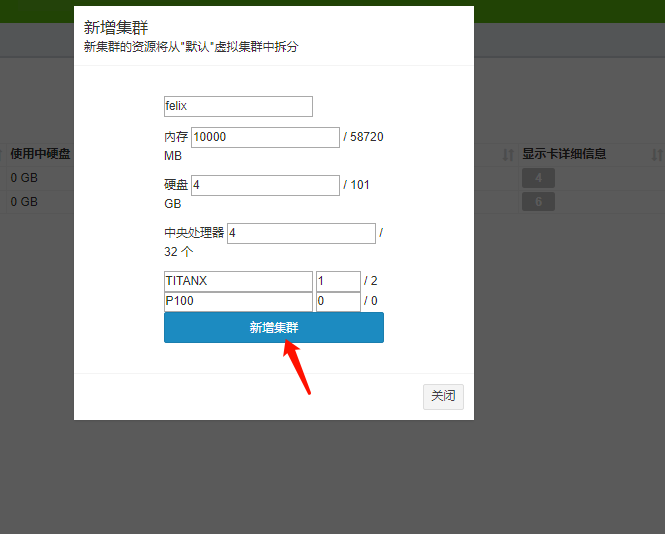
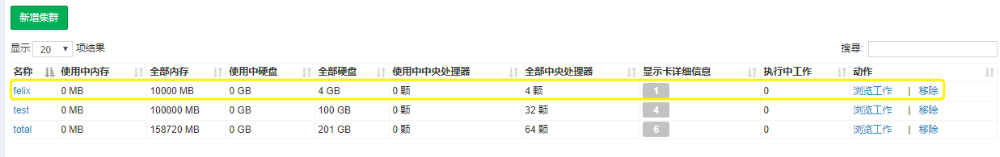

# 集群管理功能
系统采用轻量级Docker容器技术和Kuberates容器管理方案，实现对CPU、GPU、内存、磁盘等资源的统一管理。针对人工智能领域的特定需求，提供GPU等异构计算资源管理接口，实现对GPU等异构计算资源的虚拟化统一管理。   
### 集群管理功能
* 新建集群       
用户可以根据需求从资源池中获取GPU、CPU、内存等资源创建一个集群。    
* 查看集群状态     
用户可以查看集群的内存使用率、CPU使用率、GPU使用率和运行在本集群下的作业等信息。   
* 删除集群     
用户可以删除集群，将资源归还到资源池。   

## 第1节  新建集群  
   
*图1-1 集群管理*    
如图1-1，单击`1->2`即可进入集群管理界面。
* 单击`3`进入新建集群界面，如图1-2.    
    
*图1-2 新建集群*  
然后单击图1-2中的`新增集群`即可创建新的集群。如图1-3：    
    
*图1-3 新建集群后显示信息*   
## 第2节 查看集群状态
如图1-1，单击`1->2`即可进入集群管理界面。   
* 可以观察到集群的GPU、CPU、内存等信息。同时可以按关键字搜索集群。
## 第3节 删除集群
如图1-1，单击`1->2`即可进入集群管理界面。
* 单击`7`可以删除此集群。