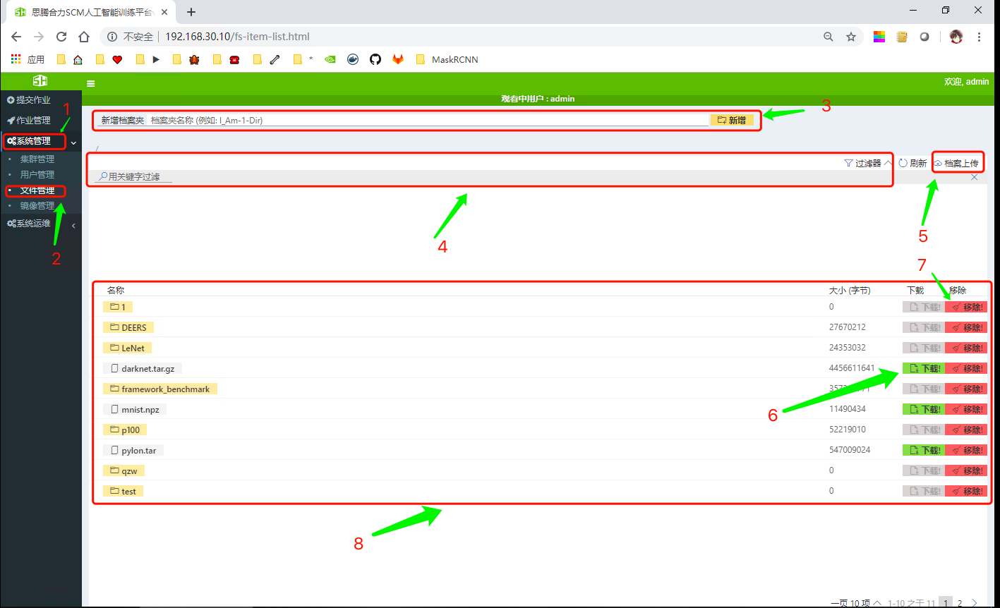

# 文件管理
系统采用NFS（网络文件系统）作为文件存储架构，可以方便地访问服务器端文件，支持infiniband高速通信，其过程与访问本地存储时一样简单快速。 
### 文件管理功能
* 文件上传    
用户可以通过web方式将本地的数据集和代码上传到服务端，以供用户调用。    
* 文件下载    
用户可以通过web方式将训练好的模型等文件下载到本地。     
* 文件在线查看    
用户可以通过命令行和web方式对文件的权限、内容等进行查看和修改。    
## 第1节 文件上传
    
*图1-1 文件管理*   
如图1-1，单击`1->2`进入文件管理界面。
* 单击`5`进行文件上传，如图1-2.    
   
*图1-2 文件上传界面*   

## 第2节 文件下载
如图1-1，单击`1->2`进入文件管理界面。
* 单击`6`进行文件下载。    
## 第3节 文件在线查看
如图1-1，单击`1->2`进入文件管理界面。可以查看文件大小等信息。    
* 单击`3`在当前目录新增文件或文件夹。
* 单击`7`删除当前文件或文件夹。
* 使用`4`进行文件夹或文件搜索。

