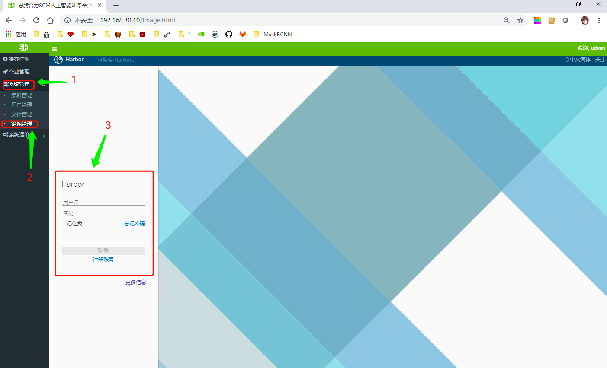
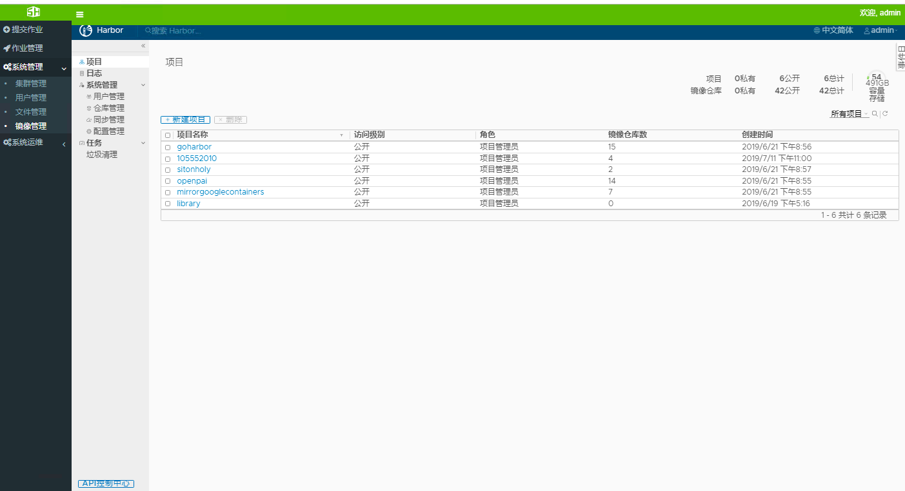

# 镜像管理
系统采用Harbor作为镜像管理的底层，提供自定义开发环境的功能，用户可以将特定的开发环境封装成Docker镜像，上传到服务器并进行管理，待下次使用，直接启动镜像即可，快速而简单。
### 镜像管理功能
* 封装镜像    
用户将正在运行的docker容器封装成镜像，并上传到Harbor镜像仓库或DockerHub镜像仓库，以备下次使用。    
* 上传镜像   
* 下载镜像   
* 删除镜像   
## 一、登陆镜像服务器
   
*图1-1 登陆界面*    
如图1-1，单击`1->2`进入镜像管理服务的登陆界面，然后在`3`中填写用户信息，等会服务，如图1-2:    
   
*图1-2 镜像管理界面*   

## 二、上传镜像
#### 1、命令行模式

## 三、下载镜像

## 四、删除镜像