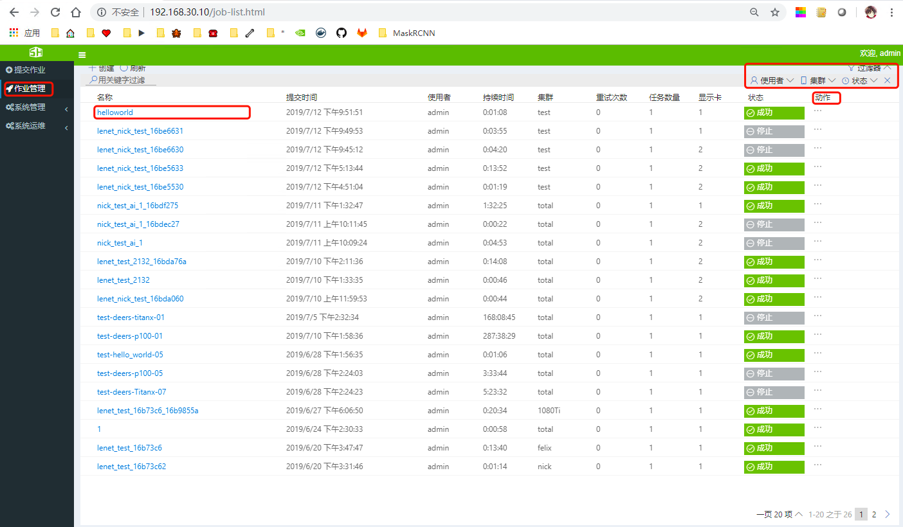
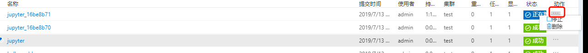
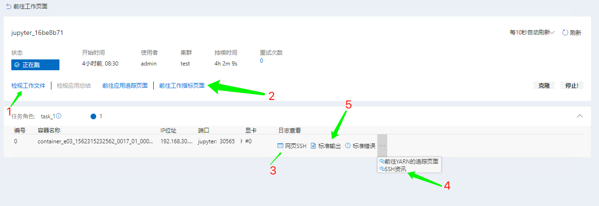
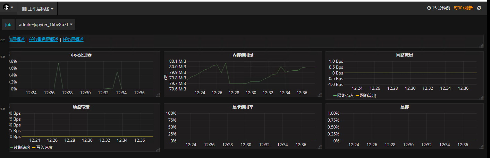
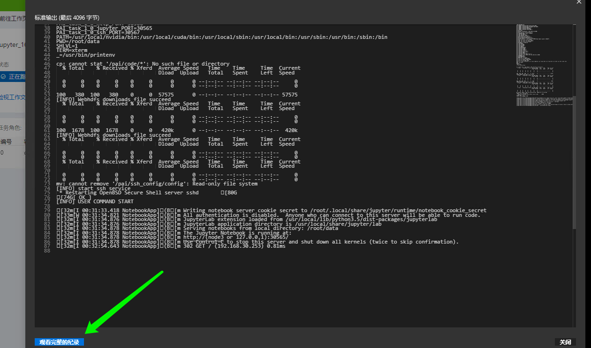

# 作业管理
系统提供训练作业管理功能，包括查看和修改作业运行状态（等待、运行、错误、终止、完成等）、作业快速克隆。     
系统提供作业的日志查看功能，可以查看从提交作业到作业结束等所有状态的日志信息，支持训练过程中输出损失率、准确率等动态可视化监控图表，同时支持实时输出训练过程日志，并提供日志下载功能，方便用户调试。   

## 第1节 查看作业信息
   
*图1-1 作业管理*    
单击`作业管理`进入作业管理界面，可以查看当前用户所提交的作业，以及作业的提交时间、提交用户、运行时间、所在集群、运行状态等信息。   
## 第2节  管理作业
   
*图1-2 停止&删除作业*    
如图1-2，单击`动作下的按钮`，可以停止作业、删除作业。 
## 第3节 监控作业/查看作业日志   
在图1-1中，单击`作业名称`，即可进入作业的详细信息。    
    
*图1-3 作业管理*    
* 单击`1`可以查看当前作业的JSON
* 单击`2`可以以图形化的方式查看当前作业对硬件资源的使用情况，
    
* 单击`3`可以以web ssh方式进入容器
* 单击`4`可以获取连接SSH的密钥
* 单击`5`可以查看当前作业日志
   

