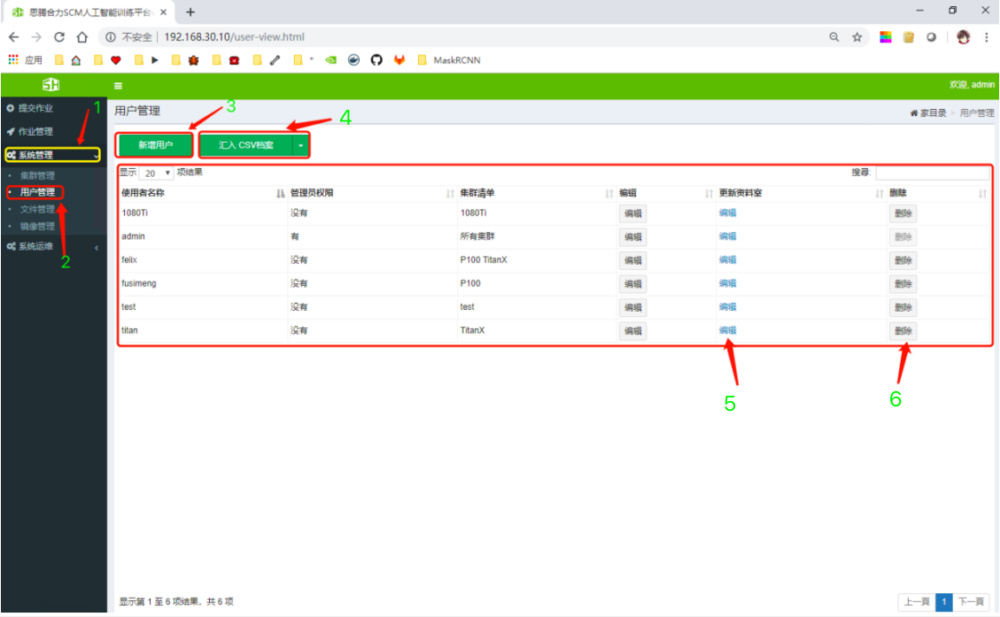
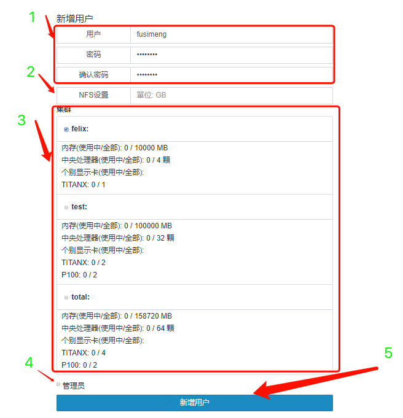
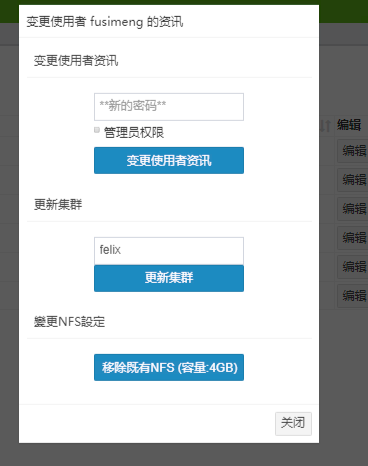

# 用户管理
系统支持**管理员**和**普通用户**两种角色用户，管理员可以为普通用户创建一个或多个独立的GPU集群环境，并可以限制CPU、GPU、内存等资源量的大小，将资源分割成多个独立的集群，方便为多个部门提供服务。
### 用户管理功能
* 新增用户    
管理员可以新增用户，为用户设定用户、角色、密码和可以使用的集群等信息。
* 查看用户信息    
管理员可以查看用户的所有信息。   
* 修改用户信息     
管理员可以修改用户的密码、角色、可使用的集群和存储空间的大小。    
* 删除用户    
管理员可以删除用户。   

## 第1节 新增用户
 
### 1、新建用户（方式1）
    
*图1-1 管理界面*   
如图1-1，单击`1->2`进入用户管理界面。
* 单击`3`可以新增用户。   
   
*图1-2 新建用户*    
如图1-2，图中`1`可以填写用户的基本信息，`2`设置此用户可使用的共享存储的大小，`3`设置此用户可以使用的集群，`4`设置此用户是普通用户还是管理员。最后单击`5`即可创建用户。
### 2、新建用户（方式2）
如图1-1，单击`1->2`进入用户管理界面。
* 单击`4`可以批量导入用户（CVS格式文件）。   

## 第2节 查看用户信息
如图1-1，单击`1->2`进入用户管理界面。
* 可以查看用户是否为管理员、所使用的集群等功能。   
## 第3节 修改用户信息
如图1-1，单击`1->2`进入用户管理界面。
* 单击`编辑`可以修改用户信息。   
   
*图3-1 修改用户信息*    
* 单击`5`可以管理此用户的文件。    

## 第4节 删除用户
如图1-1，单击`1->2`进入用户管理界面。
* 单击`6`可以删除此用户。   
