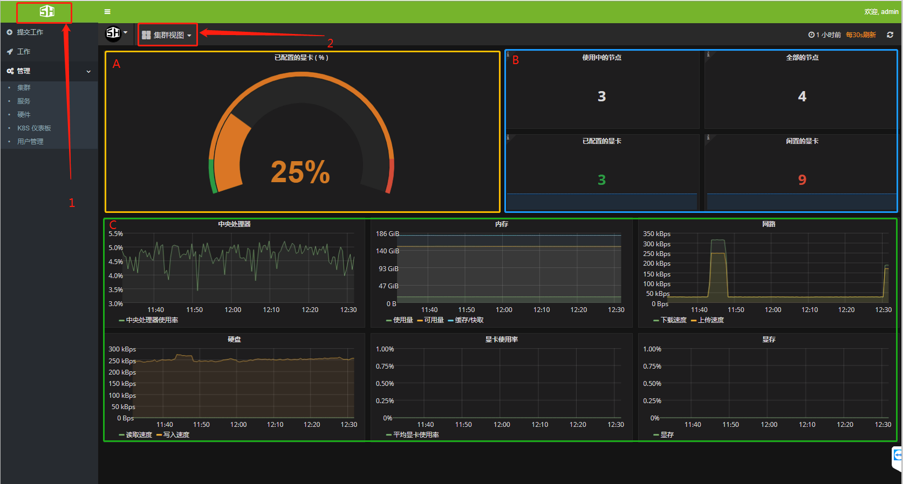
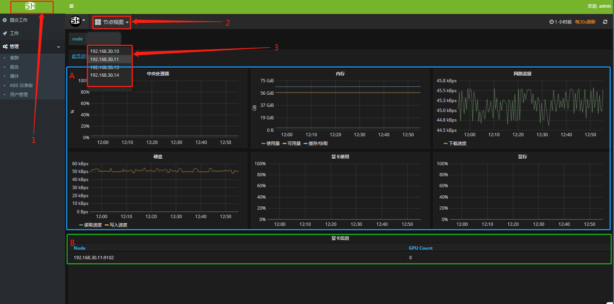
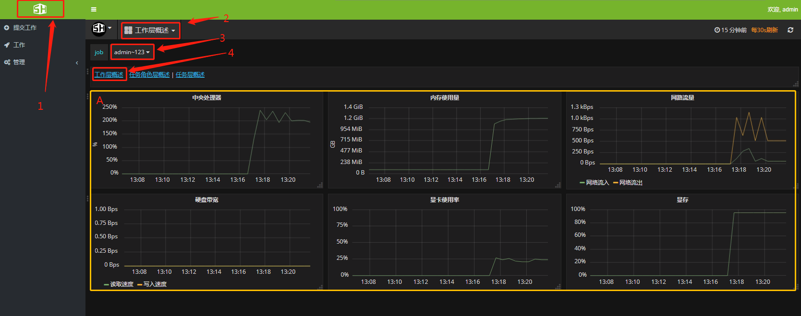
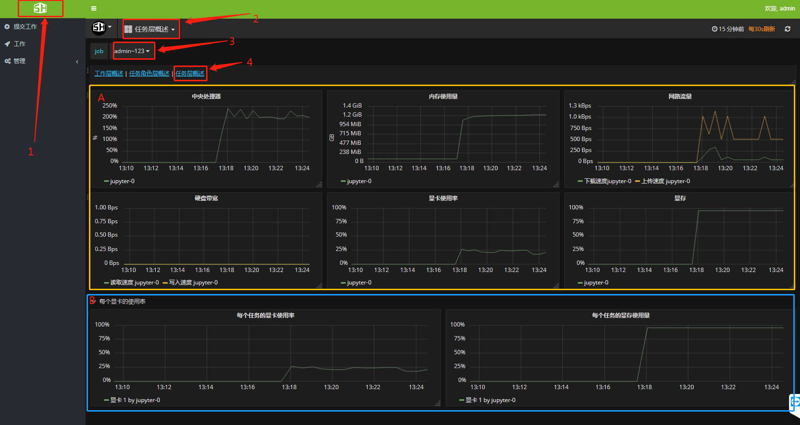
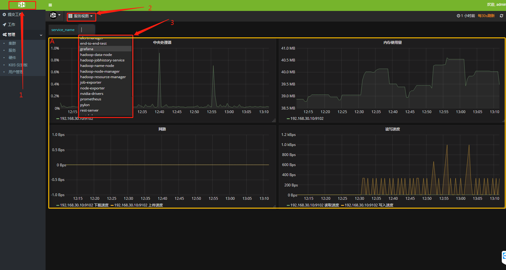

# 资源监控
SCM使用Granfana提供监控服务，对集群资源有强大的监控功能，具有集群资源监控功能，节点资源监控功能，底层服务状态监控功能，已提交的作业监控功能等。不仅对每个资源提供实时监控功能，还可以以一定的时间范围查看过去某一段时间的资源状况。   
### 资源监控功能
* 集群（cluster）资源监控
* 节点（node）资源监控
* 节点中工作（jobs）监控
* 工作层（job）监控
* 任务角色层（task-roles）监控
* 任务层（task）监控
* 服务层（services）监控
* 时间区间监控

## 第1节 集群（cluster）资源监控
   
如图所示，单击`1-->2`即可显示集群的整体信息。

区域A 是集群中GPU的仪表盘，显示了整个集群中GPU的使用率。

区域B 显示了集群的节点总数，已使用的节点数，显卡（GPU）总数以及已使用的显卡数。

区域C 显示了整个集群的CPU使用状况、内存使用状况、网络流量、硬盘读写速度以及显卡使用状况。
## 第2节 节点（node）资源监控
    
如图所示，单击`1-->2-->3`即可显示集群中某一节点的监控信息。

区域A 显示了某一节点CPU、内存、网络流量、硬盘以及显卡的负载状况。

区域B 显示了某一节点的显卡总数。
## 第3节  节点中作业（jobs）监控
    
单击`1-->2--->3`即可进入节点中作业监控界面.

区域A 显示了该节点内所有运行的任务对CPU、内存、网络、硬盘以及显卡的使用状况。如图所示当前节点（192.168.30.13）运行三个job。

区域B 显示了当前节点下每个job中task相关信息。

* job name：作业名称
* task role： 任务角色
* task index：task ID
* user name：提交者用户名

## 第4节 作业层（job）监控
   
如图所示，单击`1-->2-->3`，即可进入工作层监控界面。    
 区域A 显示了整个job占用CPU，内存、网络流量、硬盘和显卡使用状况。

## 第5节  任务角色层（task-roles）监控
   
如图所示，单击`1-->2-->3-->4`即可进入任务角色层监控界面。

区域A 显示了当前job下，每个task-role占用CPU、内存、网络、硬盘以及显卡使用的状况。

## 第6节  任务层（task）监控
    
如图所示，单击`1-->2-->3-->4`即可显示任务层监控界面。

区域A 显示了每个task对CPU、内存、GPU等使用状况。

区域B 显示了每张显卡的使用状况。

## 第7节    服务层（services）监控
   
单击`1-->2-->3`即可显卡服务层信息。

区域A 显示某一项底层服务使用CPU、内存、网络和读写速度等信息。

## 第8节 时间区间监控
    
如图所示，单击`1-->2`并设置区域A或B即可改变C区域的监控范围。

区域A 自定义监控时间范围。
区域B 快速定义监控时间范围。
区域C 显示监控信息。
